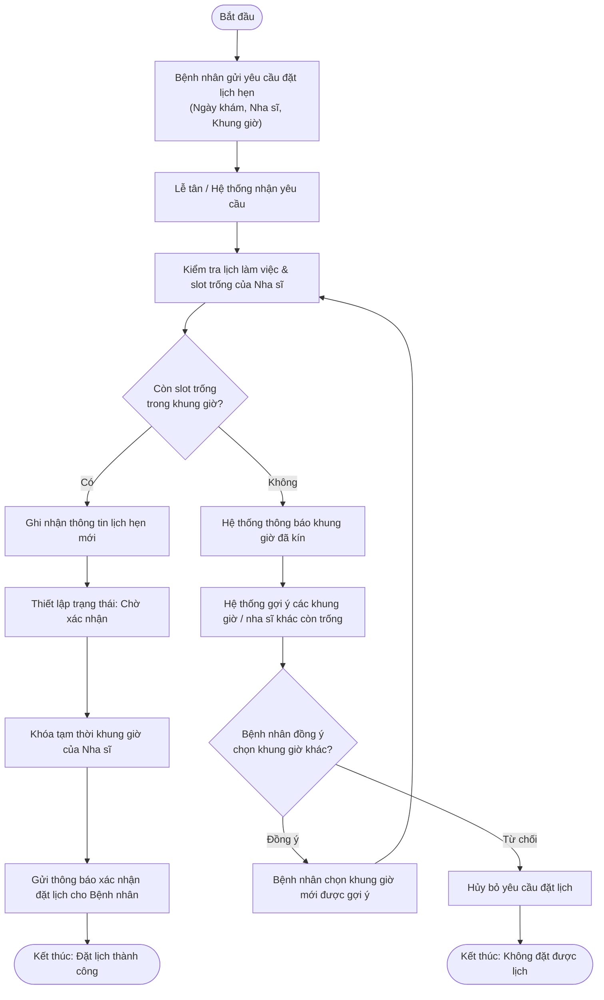
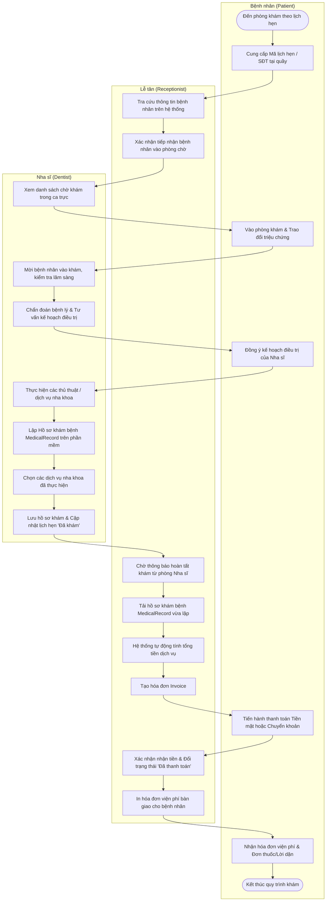
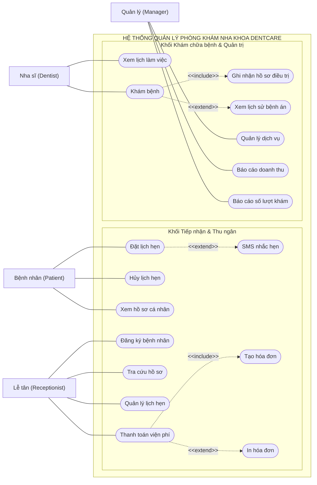
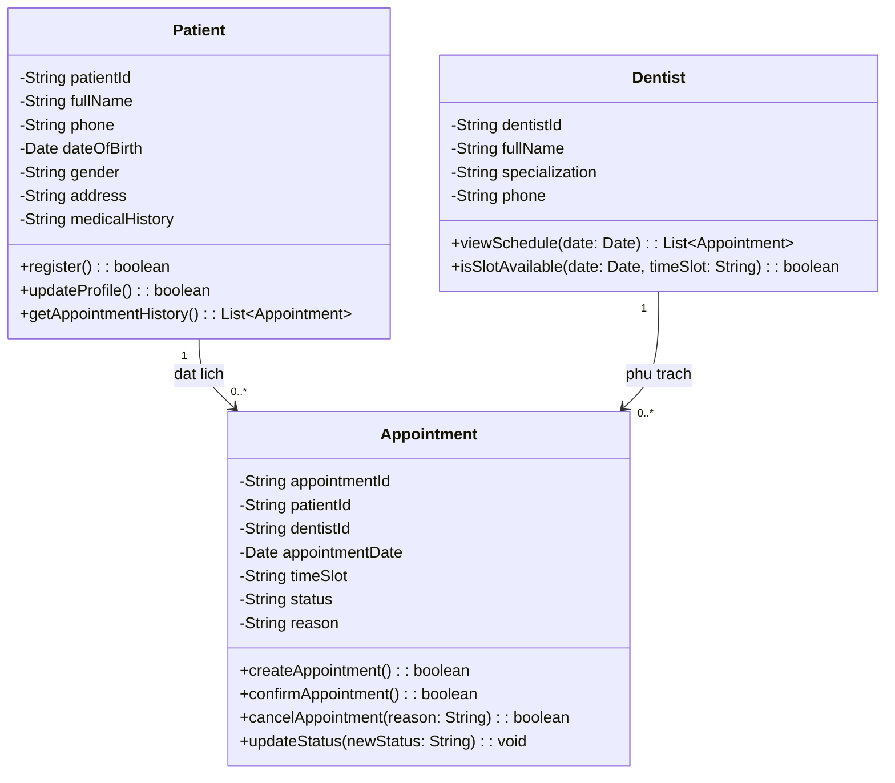
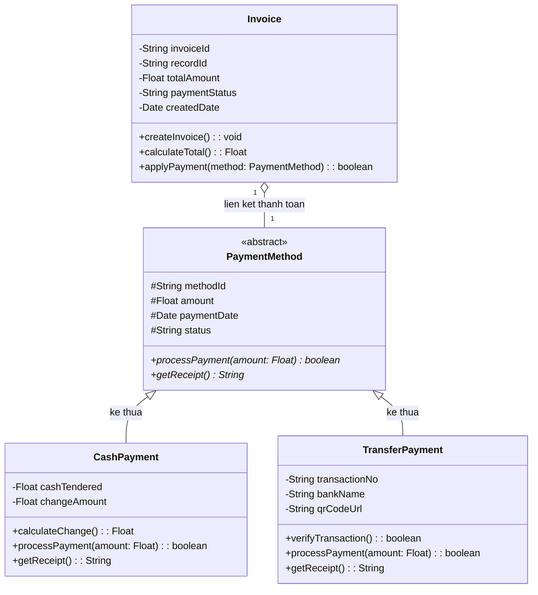
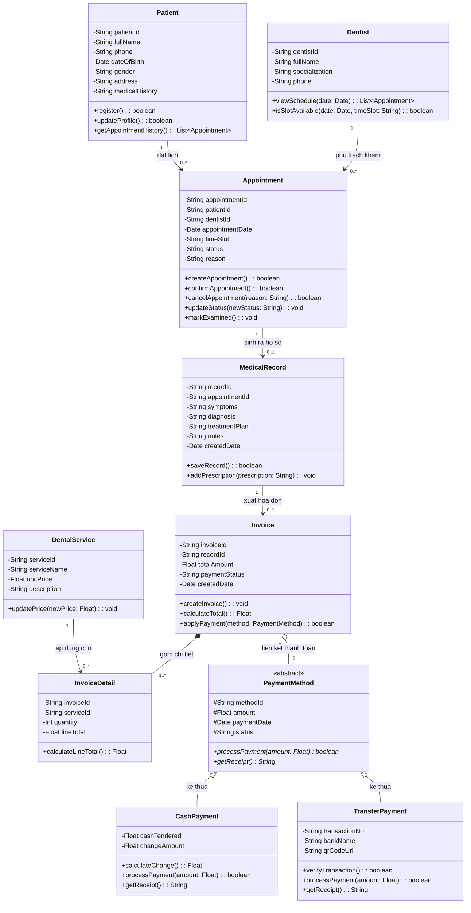
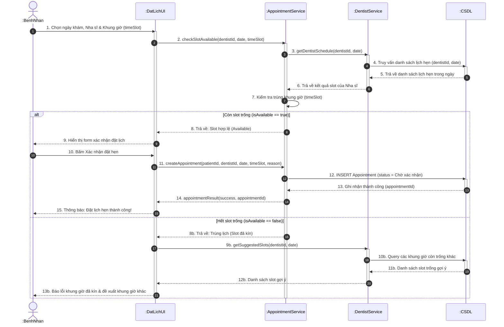
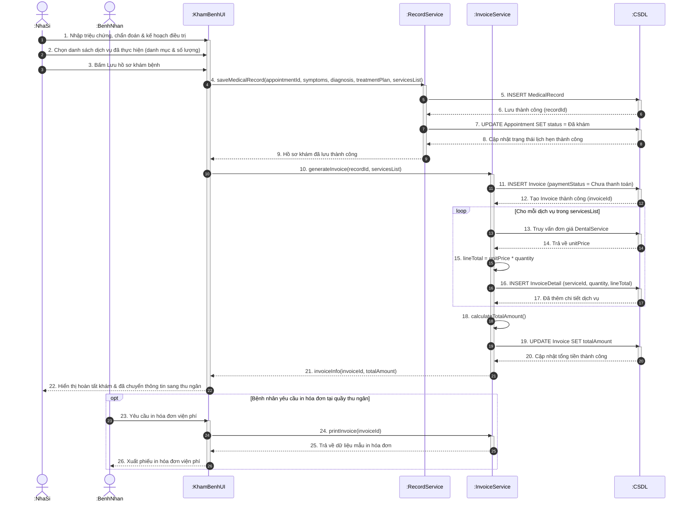
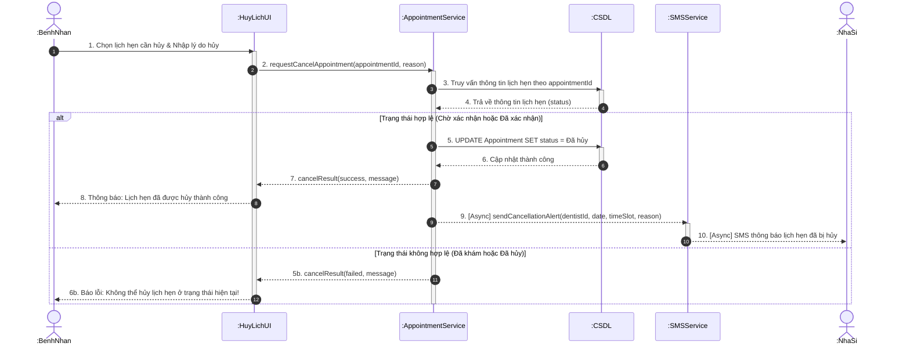

# BÁO CÁO PHÂN TÍCH & THIẾT KẾ HỆ THỐNG THÔNG TIN
# ĐỀ TÀI: HỆ THỐNG QUẢN LÝ PHÒNG KHÁM NHA KHOA DENTCARE

## MỤC LỤC
1. [PHẦN I: PHÂN TÍCH HỆ THỐNG THÔNG TIN VÀ THU THẬP YÊU CẦU](#phần-i-phân-tích-hệ-thống-thông-tin-và-thu-thập-yêu-cầu)
   - 1.1. Nhận diện 5 thành phần HTTT & Phân loại hệ thống
   - 1.2. Phân tích quy trình SDLC & Lựa chọn mô hình phát triển phần mềm
   - 1.3. Phân tích Stakeholders, Nguồn yêu cầu & Kỹ thuật thu thập
   - 1.4. Phân loại yêu cầu hệ thống (Chức năng & Phi chức năng)
   - 1.5. Danh sách User Stories chi tiết kèm Tiêu chí nghiệm thu (Acceptance Criteria)
2. [PHẦN II: MÔ HÌNH HÓA QUY TRÌNH NGHIỆP VỤ (ACTIVITY & USE CASE)](#phần-ii-mô-hình-hóa-quy-trình-nghiệp-vụ-activity--use-case)
   - 2.1. Sơ đồ hoạt động (Activity Diagram) – Luồng Đặt lịch hẹn
   - 2.2. Sơ đồ hoạt động (Activity Diagram) – Luồng Khám bệnh và Thanh toán (Swimlane)
   - 2.3. Sơ đồ ca sử dụng tổng thể (Use Case Diagram)
   - 2.4. Bảng đặc tả Use Case chi tiết: "Đặt lịch hẹn"
3. [PHẦN III: THIẾT KẾ CẤU TRÚC TĨNH (CLASS DIAGRAM)](#phần-iii-thiết-kế-cấu-trúc-tĩnh-class-diagram)
   - 3.1. Phân hệ Bệnh nhân – Lịch hẹn – Nha sĩ
   - 3.2. Phân hệ Thanh toán áp dụng Kế thừa (Generalization)
   - 3.3. Sơ đồ lớp tổng thể (Comprehensive Class Diagram)
4. [PHẦN IV: MÔ HÌNH HÓA TƯƠNG TÁC (SEQUENCE DIAGRAM)](#phần-iv-mô-hình-hóa-tương-tác-sequence-diagram)
   - 4.1. Sơ đồ tuần tự: Đặt lịch hẹn
   - 4.2. Sơ đồ tuần tự: Khám bệnh và Tạo hóa đơn
   - 4.3. Sơ đồ tuần tự: Hủy lịch hẹn
5. [PHẦN V: RÀNG BUỘC NGHIỆP VỤ VÀ MA TRẬN PHÂN QUYỀN](#phần-v-ràng-buộc-nghiệp-vụ-và-ma-trận-phân-quyền)
   - 5.1. Quy tắc xác thực dữ liệu đầu vào (Validation)
   - 5.2. Quy tắc nghiệp vụ cốt lõi (Business Rules) & Toàn vẹn dữ liệu
   - 5.3. Ma trận phân quyền chi tiết (RBAC Matrix)
6. [PHẦN VI: HIỂN THỊ, BÁO CÁO VÀ MA TRẬN TRUY VẾT (TRACEABILITY MATRIX)](#phần-vi-hiển-thị-báo-cáo-và-ma-trận-truy-vết-traceability-matrix)
   - 6.1. Đặc tả màn hình báo cáo & Tra cứu
   - 6.2. Ma trận truy vết xuyên suốt (Traceability Matrix)

---

# PHẦN I: PHÂN TÍCH HỆ THỐNG THÔNG TIN VÀ THU THẬP YÊU CẦU

## 1.1. Nhận diện 5 thành phần HTTT & Phân loại hệ thống

### 1. Nhận diện 5 thành phần của Hệ thống thông tin DentCare
Một hệ thống thông tin hoàn chỉnh bao gồm 5 thành phần cốt lõi:

| Thành phần | Thành phần cụ thể trong dự án DentCare | Mô tả chức năng / Vai trò |
| :--- | :--- | :--- |
| **1. Phần cứng (Hardware)** | - Máy chủ ứng dụng & CSDL (Cloud VPS / Local Server). - Máy tính bàn / Laptop tại quầy Lễ tân và phòng khám Nha sĩ. - Thiết bị in hóa đơn nhiệt / in phiếu khám. - Điện thoại thông minh / Máy tính của Bệnh nhân. | Đảm bảo hạ tầng vật lý lưu trữ dữ liệu tập trung, cho phép các bên nhập liệu, tra cứu và in ấn chứng từ giao dịch. |
| **2. Phần mềm (Software)** | - Hệ điều hành (Windows/Linux). - Hệ quản trị CSDL quan hệ (MySQL / PostgreSQL). - Ứng dụng Quản lý DentCare (Web/Desktop App). - Trình duyệt web (Chrome, Edge) và dịch vụ gửi SMS tự động. | Cung cấp giao diện người dùng, logic xử lý lịch hẹn, bệnh án, hóa đơn và lưu trữ an toàn. |
| **3. Dữ liệu (Data)** | - Hồ sơ bệnh nhân (mã, họ tên, SĐT, ngày sinh, tiền sử). - Lịch hẹn khám (ngày hẹn, khung giờ slot, trạng thái). - Hồ sơ bệnh án điều trị (triệu chứng, chẩn đoán, kế hoạch). - Danh mục dịch vụ nha khoa và đơn giá. - Hóa đơn thanh toán & chi tiết hóa đơn. | "Tài sản số" của phòng khám, được tổ chức chuẩn hóa, đảm bảo tính toàn vẹn và bảo mật cao. |
| **4. Quy trình (Procedures)** | - Quy trình tiếp nhận & đăng ký bệnh nhân mới. - Quy trình kiểm tra slot trống và đặt/hủy lịch hẹn. - Quy trình khám bệnh, chẩn đoán và ghi nhận bệnh án. - Quy trình xuất hóa đơn và thu ngân. - Quy trình kiểm kê dịch vụ và chốt doanh thu cuối ngày. | Chuỗi các bước hướng dẫn vận hành chuẩn (SOP) giúp nhân sự phối hợp nhịp nhàng trên phần mềm. |
| **5. Con người (People)** | - Bệnh nhân (Khách hàng sử dụng dịch vụ). - Lễ tân (Nhân viên tiếp đón, điều phối lịch, thu ngân). - Nha sĩ (Bác sĩ chuyên môn trực tiếp điều trị). - Quản lý phòng khám (Chủ phòng khám, người theo dõi tài chính). - Kỹ sư phần mềm / Quản trị viên hệ thống (Vận hành kỹ thuật). | Tác nhân trực tiếp tương tác, nhập liệu, ra quyết định và hưởng lợi ích từ hệ thống. |

### 2. Phân loại hệ thống: Vì sao DentCare thuộc loại TPS (Transaction Processing System)?
Hệ thống DentCare được phân loại là **TPS (Hệ thống Xử lý Giao dịch)** vì:
- **Xử lý các giao dịch hàng ngày theo thời gian thực:** Mỗi thao tác đặt hẹn, đổi lịch, ghi bệnh án, và xuất hóa đơn là một "giao dịch nghiệp vụ" (business transaction) diễn ra liên tục.
- **Tính toán vẹn ACID:** Đảm bảo tính nguyên tố (Atomicity), nhất quán (Consistency), cô lập (Isolation) và bền vững (Durability). Ví dụ: Khi đặt lịch, slot thời gian phải được khóa ngay lập tức để ngăn chặn tình trạng "double-booking" (trùng lịch); khi thanh toán, hóa đơn và chi tiết hóa đơn phải được ghi nhận đồng thời.
- **Hỗ trợ cấp tác nghiệp cơ sở:** DentCare phục vụ trực tiếp cho công việc thường nhật của lễ tân, nha sĩ và bệnh nhân, cung cấp nguồn dữ liệu đầu vào chuẩn xác để từ đó tạo tiền đề cho các báo cáo phân tích quản trị (MIS).

---

## 1.2. Phân tích quy trình SDLC & Lựa chọn mô hình phát triển phần mềm

### 1. Phân tích 6 giai đoạn SDLC cho dự án DentCare

| Giai đoạn SDLC | Công việc cần thực hiện tại DentCare | Kết quả đầu ra (Deliverables) |
| :--- | :--- | :--- |
| **1. Khảo sát & Lập kế hoạch (Planning)** | - Khảo sát hiện trạng vận hành bằng sổ tay, nhận diện các nút thắt (trùng lịch, mất thời gian tìm hồ sơ). - Xác định phạm vi dự án (phòng khám đơn lẻ), tính khả thi (thời gian, chi phí, công nghệ). | Bản đề xuất dự án (Project Charter), Kế hoạch quản lý thời gian và ngân sách. |
| **2. Phân tích yêu cầu (Analysis)** | - Phỏng vấn lễ tân, nha sĩ, quản lý; phát phiếu khảo sát cho bệnh nhân. - Phân tích yêu cầu nghiệp vụ, yêu cầu chức năng (FR) và phi chức năng (NFR). - Mô hình hóa quy trình hiện tại và quy trình tương lai. | Tài liệu đặc tả yêu cầu phần mềm (SRS), Danh sách User Stories, Sơ đồ Use Case. |
| **3. Thiết kế hệ thống (Design)** | - Thiết kế kiến trúc tổng thể, mô hình dữ liệu (Class Diagram, ERD). - Thiết kế tương tác động (Activity Diagram, Sequence Diagram). - Thiết kế giao diện người dùng (UI Wireframes/Mockups). | Tài liệu thiết kế hệ thống (SDD), Class Diagram, Sequence Diagram, UI Prototype. |
| **4. Lập trình (Implementation)** | - Thiết lập môi trường, xây dựng cơ sở dữ liệu. - Lập trình Backend (API, Services xử lý logic lịch hẹn, thanh toán). - Lập trình Frontend (Giao diện web/desktop cho 4 đối tượng). | Mã nguồn chương trình (Source Code), CSDL hoạt động, API Documentation. |
| **5. Kiểm thử (Testing)** | - Kiểm thử đơn vị (Unit Test), kiểm thử tích hợp (Integration Test). - Kiểm thử xác thực nghiệp vụ: kiểm tra trùng lịch hẹn, tính tiền hóa đơn, xác thực SĐT. - Kiểm thử chấp nhận người dùng (UAT) với Lễ tân và Nha sĩ. | Kế hoạch kiểm thử (Test Plan), Bộ kịch bản kiểm thử (Test Cases), Báo cáo lỗi (Bug Report). |
| **6. Triển khai & Bảo trì (Deployment)** | - Cài đặt hệ thống lên máy chủ, chuyển đổi dữ liệu bệnh nhân cũ sang hệ thống mới. - Đào tạo lễ tân, nha sĩ sử dụng phần mềm. - Theo dõi vận hành thực tế, vá lỗi và hỗ trợ kỹ thuật định kỳ. | Hệ thống DentCare đi vào hoạt động chính thức (Go-live), Tài liệu hướng dẫn sử dụng (User Manual). |

### 2. So sánh và Lựa chọn mô hình phát triển phần mềm

| Tiêu chí | Mô hình Waterfall (Thác nước) | Mô hình Agile / Scrum | Đánh giá đối với DentCare |
| :--- | :--- | :--- | :--- |
| **Khả năng thích ứng thay đổi** | Kém, khó thay đổi yêu cầu sau khi đã hoàn thành pha thiết kế. | Rất cao, linh hoạt điều chỉnh theo từng Sprint (1-2 tuần). | **Nghiêng về Agile:** Quy trình khám nha khoa có thể phát sinh thêm biểu mẫu, dịch vụ mới. |
| **Thời gian có sản phẩm dùng thử** | Rất muộn (chỉ có vào giai đoạn cuối của dự án). | Rất sớm (mỗi Sprint đều có tính năng hoàn chỉnh có thể demo). | **Nghiêng về Agile:** Lễ tân và Nha sĩ cần trải nghiệm sớm tính năng đặt lịch và ghi bệnh án để góp ý. |
| **Mức độ tham gia của người dùng** | Tập trung nhiều ở đầu và cuối dự án. | Liên tục trong suốt quá trình phát triển (qua các buổi Sprint Review). | **Nghiêng về Agile:** Giúp bám sát thực tế thao tác của phòng khám. |
| **Rủi ro dự án** | Cao (nếu sai sót ở khâu phân tích sẽ đội chi phí sửa chữa rất lớn). | Thấp (phát hiện và khắc phục sai lệch ngay trong từng chu kỳ ngắn). | **Nghiêng về Agile:** Giảm thiểu rủi ro xây dựng tính năng không thực tế. |

> **Kết luận lựa chọn:** Đề xuất áp dụng **Mô hình Agile/Scrum**.
> - **Lý do:** Dự án DentCare là hệ thống thông tin quy mô vừa, người dùng (Lễ tân, Nha sĩ) cần phản hồi trực tiếp về độ tiện dụng của màn hình đặt lịch và ghi bệnh án. Chia dự án thành 3-4 Sprint (Sprint 1: Quản lý bệnh nhân & Danh mục dịch vụ; Sprint 2: Đặt lịch hẹn & Ngăn trùng lịch; Sprint 3: Khám bệnh & Lập hóa đơn; Sprint 4: Báo cáo thống kê & Phân quyền) sẽ mang lại sản phẩm chất lượng cao, đúng nhu cầu thực tế và dễ bàn giao.

---

## 1.3. Phân tích Stakeholders, Nguồn yêu cầu & Kỹ thuật thu thập

### Bảng kế hoạch thu thập yêu cầu:
| Nhóm Stakeholder | Nguồn yêu cầu cụ thể | Kỹ thuật thu thập đề xuất | Nội dung khai thác trọng tâm |
| :--- | :--- | :--- | :--- |
| **Bệnh nhân (Patient)** | Trải nghiệm đặt hẹn, thời gian chờ, thông báo nhắc hẹn. | **Khảo sát bằng bảng hỏi (Survey / Questionnaire)** kết hợp phỏng vấn ngắn tại quầy chờ. | Khảo sát nhu cầu đặt hẹn online, hình thức nhận thông báo nhắc lịch (SMS/Zalo), sự thuận tiện khi tra cứu tiền sử bệnh án. |
| **Lễ tân (Receptionist)** | Sổ tay ghi lịch hẹn, tập phiếu đăng ký, quy trình thanh toán tiền mặt/chuyển khoản. | **Quan sát hiện trường (Observation)** + **Phỏng vấn sâu (In-depth Interview)**. | Quan sát cách lễ tân dò tìm khung giờ trống trên sổ, các lỗi trùng lịch hay gặp; ghi nhận quy trình tính tiền và in hóa đơn. |
| **Nha sĩ (Dentist)** | Mẫu bệnh án nha khoa giấy, quy trình các bước khám - chẩn đoán - chỉ định dịch vụ. | **Phỏng vấn bán cấu trúc (Semi-structured Interview)** + **Phân tích tài liệu (Document Analysis)**. | Khảo sát các thông tin bệnh lý bắt buộc cần lưu trữ (triệu chứng, răng cần điều trị, kế hoạch tái khám) để chuẩn hóa form điện tử. |
| **Quản lý (Manager)** | Báo cáo doanh thu tháng viết tay, danh mục bảng giá dịch vụ hiện hành. | **Phỏng vấn quản lý (Stakeholder Meeting)** + **Phân tích tài liệu kế toán**. | Xác định công thức tính doanh thu, các chỉ số KPI cần theo dõi (số ca khám/ngày, tỷ trọng từng loại dịch vụ, doanh thu định kỳ). |

---

## 1.4. Phân loại yêu cầu hệ thống

### 1. Yêu cầu chức năng (Functional Requirements - FR)
- **FR1 (Quản lý Bệnh nhân):** Hệ thống cho phép đăng ký mới, cập nhật thông tin cá nhân và tra cứu hồ sơ bệnh nhân theo Mã hoặc Số điện thoại.
- **FR2 (Đặt lịch hẹn khám):** Cho phép chọn ngày, nha sĩ, khung giờ khám; tự động kiểm tra slot trống và khóa slot khi xác nhận; cho phép hủy/dời lịch khi đủ điều kiện.
- **FR3 (Quản lý Lịch làm việc Nha sĩ):** Hiển thị lịch làm việc của từng nha sĩ theo ngày/tuần; hiển thị danh sách bệnh nhân đã đăng ký theo từng slot.
- **FR4 (Tiếp nhận & Khám bệnh):** Cho phép nha sĩ nhập triệu chứng, chẩn đoán, kế hoạch điều trị và chỉ định các dịch vụ nha khoa thực hiện cho ca khám.
- **FR5 (Quản lý Dịch vụ Nha khoa):** Cho phép Quản lý thêm mới, chỉnh sửa tên dịch vụ, đơn giá và mô tả dịch vụ nha khoa.
- **FR6 (Thanh toán viện phí):** Tự động tổng hợp chi phí các dịch vụ đã khám, tạo hóa đơn viện phí, hỗ trợ thanh toán tiền mặt/chuyển khoản và in hóa đơn.
- **FR7 (Báo cáo & Thống kê):** Thống kê doanh thu theo ngày/tháng/năm, thống kê số lượt khám bệnh và báo cáo danh mục dịch vụ.

### 2. Yêu cầu phi chức năng (Non-Functional Requirements - NFR)
- **NFR1 - Hiệu năng (Performance):** Thời gian phản hồi khi kiểm tra slot trống và tra cứu hồ sơ bệnh nhân không quá 2 giây. Hỗ trợ tối thiểu 50 người dùng đồng thời.
- **NFR2 - An toàn & Bảo mật (Security):** Mật khẩu người dùng được mã hóa chuẩn (bcrypt/Argon2). Phân quyền truy cập nghiêm ngặt theo vai trò (RBAC). Dữ liệu bệnh án nhạy cảm chỉ nha sĩ phụ trách và ban quản lý mới được xem.
- **NFR3 - Tính toàn vẹn dữ liệu (Data Integrity):** Không cho phép trùng lặp lịch hẹn trên cùng 1 nha sĩ trong 1 khung giờ. Khi xóa tài khoản bệnh nhân, bắt buộc giữ lại lịch sử hồ sơ khám bệnh và hóa đơn.
- **NFR4 - Độ khả dụng (Availability & Reliability):** Hệ thống đảm bảo thời gian hoạt động (uptime) $\ge 99.5\%$ trong giờ hành chính của phòng khám. Tự động sao lưu dữ liệu dự phòng định kỳ hàng ngày.
- **NFR5 - Tính khả dụng & Thân thiện (Usability):** Giao diện thiết kế rõ ràng, thân thiện; lễ tân có thể hoàn tất việc tạo mới một lịch hẹn trong vòng dưới 60 giây.

---

## 1.5. Danh sách User Stories chi tiết kèm Tiêu chí nghiệm thu (Acceptance Criteria)

### Phân hệ 1: Bệnh nhân (Patient)
- **US-01 (Đặt lịch hẹn):**
  > Là một **Bệnh nhân**, tôi muốn **tự chọn ngày, nha sĩ và khung giờ còn trống để đặt lịch hẹn khám**, để **chủ động thời gian và không phải chờ đợi lâu khi đến phòng khám.**
  - *Acceptance Criteria:*
    - **Given:** Bệnh nhân đã đăng nhập vào hệ thống và chọn một ngày khám hợp lệ ($\ge$ ngày hiện tại).
    - **When:** Bệnh nhân chọn một nha sĩ và một khung giờ (timeSlot) còn trống rồi bấm "Xác nhận đặt lịch".
    - **Then:** Hệ thống lưu lịch hẹn với trạng thái "Chờ xác nhận", gửi mã lịch hẹn cho bệnh nhân và khóa khung giờ đó.
- **US-02 (Hủy lịch hẹn):**
  > Là một **Bệnh nhân**, tôi muốn **hủy lịch hẹn đã đặt trước đó**, để **nhường khung giờ đó cho bệnh nhân khác khi tôi có việc bận đột xuất.**
  - *Acceptance Criteria:*
    - **Given:** Lịch hẹn của bệnh nhân đang ở trạng thái "Chờ xác nhận" hoặc "Đã xác nhận".
    - **When:** Bệnh nhân bấm nút "Hủy lịch" và nhập lý do hủy.
    - **Then:** Hệ thống cập nhật trạng thái thành "Đã hủy", giải phóng slot khám và gửi thông báo cho lễ tân/nha sĩ. Nếu lịch hẹn đã ở trạng thái "Đã khám", hệ thống từ chối và báo lỗi không thể hủy.
- **US-03 (Xem hồ sơ cá nhân):**
  > Là một **Bệnh nhân**, tôi muốn **xem lại thông tin cá nhân và lịch sử các lần khám bệnh của mình**, để **theo dõi tình trạng sức khỏe răng miệng.**
  - *Acceptance Criteria:*
    - **Given:** Bệnh nhân đăng nhập thành công.
    - **When:** Bệnh nhân truy cập mục "Hồ sơ của tôi".
    - **Then:** Hệ thống hiển thị đầy đủ thông tin cá nhân, danh sách các đợt khám kèm chẩn đoán của nha sĩ (không cho phép chỉnh sửa).

### Phân hệ 2: Lễ tân (Receptionist)
- **US-04 (Đăng ký hồ sơ bệnh nhân mới):**
  > Là một **Lễ tân**, tôi muốn **nhập thông tin của bệnh nhân mới đến phòng khám**, để **tạo hồ sơ lưu trữ cho các lần khám tiếp theo.**
  - *Acceptance Criteria:*
    - **Given:** Lễ tân mở form "Đăng ký bệnh nhân".
    - **When:** Nhập họ tên, SĐT (10 số), ngày sinh ($\le$ ngày hiện tại), giới tính và bấm "Lưu".
    - **Then:** Hệ thống sinh mã bệnh nhân tự động duy nhất (VD: `BN-0001`) và lưu vào CSDL. Nếu SĐT đã tồn tại, hiển thị cảnh báo trùng lặp.
- **US-05 (Điều phối & Xác nhận lịch hẹn):**
  > Là một **Lễ tân**, tôi muốn **kiểm tra danh sách lịch hẹn chờ xác nhận và duyệt lịch cho bệnh nhân**, để **sắp xếp lịch làm việc chuẩn xác cho các nha sĩ.**
  - *Acceptance Criteria:*
    - **Given:** Có lịch hẹn ở trạng thái "Chờ xác nhận".
    - **When:** Lễ tân gọi điện xác nhận và bấm nút "Xác nhận lịch".
    - **Then:** Trạng thái chuyển thành "Đã xác nhận", nha sĩ thấy lịch trên giao diện làm việc.
- **US-06 (Lập hóa đơn & Thu ngân):**
  > Là một **Lễ tân**, tôi muốn **tạo hóa đơn viện phí từ hồ sơ khám của nha sĩ và ghi nhận thanh toán**, để **hoàn tất quy trình khám và giao chứng từ thu tiền cho bệnh nhân.**
  - *Acceptance Criteria:*
    - **Given:** Nha sĩ đã hoàn tất và lưu Hồ sơ khám bệnh (`MedicalRecord`).
    - **When:** Lễ tân chọn hồ sơ khám đó để tạo hóa đơn, chọn hình thức thanh toán (Tiền mặt / Chuyển khoản).
    - **Then:** Hệ thống tự động tính tổng tiền từ các chi tiết dịch vụ, lưu trạng thái "Đã thanh toán" và xuất hóa đơn ra màn hình để in.

### Phân hệ 3: Nha sĩ (Dentist)
- **US-07 (Xem lịch làm việc cá nhân):**
  > Là một **Nha sĩ**, tôi muốn **xem danh sách các ca hẹn khám trong ngày của mình**, để **chủ động chuẩn bị dụng cụ và vật tư điều trị.**
  - *Acceptance Criteria:*
    - **Given:** Nha sĩ đăng nhập vào tài khoản cá nhân.
    - **When:** Chọn ngày làm việc trên lịch.
    - **Then:** Hệ thống hiển thị danh sách các bệnh nhân theo từng khung giờ đã được xác nhận.
- **US-08 (Khám bệnh & Ghi nhận bệnh án):**
  > Là một **Nha sĩ**, tôi muốn **ghi nhận triệu chứng, chẩn đoán, kế hoạch điều trị và chỉ định các dịch vụ nha khoa đã thực hiện**, để **lưu hồ sơ bệnh án chuẩn xác cho bệnh nhân.**
  - *Acceptance Criteria:*
    - **Given:** Nha sĩ đang tiếp nhận bệnh nhân có lịch hẹn hợp lệ.
    - **When:** Nhập triệu chứng, chẩn đoán, chọn 1 hoặc nhiều dịch vụ trong danh mục và bấm "Lưu hồ sơ khám".
    - **Then:** Hệ thống tạo bản ghi `MedicalRecord`, cập nhật trạng thái lịch hẹn thành "Đã khám", chuyển tiếp dữ liệu sang phân hệ thanh toán.

### Phân hệ 4: Quản lý phòng khám (Manager)
- **US-09 (Quản lý danh mục dịch vụ):**
  > Là một **Quản lý**, tôi muốn **thêm, sửa thông tin dịch vụ nha khoa và cập nhật đơn giá**, để **đồng bộ bảng giá khám chữa bệnh trong toàn phòng khám.**
  - *Acceptance Criteria:*
    - **Given:** Quản lý truy cập mục "Quản lý dịch vụ".
    - **When:** Nhập tên dịch vụ, đơn giá ($> 0$), mô tả và lưu.
    - **Then:** Dịch vụ mới hiển thị trong danh mục để nha sĩ chọn khi lập hồ sơ khám.
- **US-10 (Xem báo cáo doanh thu & Lượt khám):**
  > Là một **Quản lý**, tôi muốn **xem báo cáo tổng hợp doanh thu và số lượt khám theo ngày/tháng**, để **nắm bắt hiệu quả kinh doanh của phòng khám.**
  - *Acceptance Criteria:*
    - **Given:** Quản lý truy cập mục "Báo cáo thống kê".
    - **When:** Chọn khoảng thời gian (Từ ngày - Đến ngày).
    - **Then:** Hệ thống tính toán và hiển thị tổng số ca khám, tổng doanh thu thu được, biểu đồ doanh thu theo phương thức thanh toán.

---

# PHẦN II: MÔ HÌNH HÓA QUY TRÌNH NGHIỆP VỤ (ACTIVITY & USE CASE)

## 2.1. Sơ đồ hoạt động (Activity Diagram) – Luồng Đặt lịch hẹn

Quy trình đặt lịch hẹn có xử lý điều kiện kiểm tra slot trống (Decision Node) và xử lý rẽ nhánh:

---

## 2.2. Sơ đồ hoạt động (Activity Diagram) – Luồng Khám bệnh và Thanh toán (Swimlane)

Sơ đồ thể hiện sự phối hợp giữa 3 tác nhân nghiệp vụ cốt lõi: **Bệnh nhân**, **Nha sĩ**, và **Lễ tân**:

---

## 2.3. Sơ đồ ca sử dụng tổng thể (Use Case Diagram)

Sơ đồ ca sử dụng tổng thể được thiết kế theo chuẩn UML với **Ranh giới hệ thống duy nhất (System Boundary)** và **4 Tác nhân đặt ở 4 góc bên ngoài**, phân định ranh giới rõ ràng giữa người dùng và hệ thống, triệt tiêu hoàn toàn các đường đan chéo gây rối mắt:
- **Phía bên trái:** Tác nhân Tiền sảnh gồm **Bệnh nhân (Patient)** (phía trên) và **Lễ tân (Receptionist)** (phía dưới).
- **Phía bên phải:** Tác nhân Quản trị & Chuyên môn gồm **Quản lý (Manager)** (phía trên) và **Nha sĩ (Dentist)** (phía dưới).
- **Bên trong ranh giới:** Các Ca sử dụng hình Elip chuẩn UML được bố trí thẳng hàng thành 2 khối tương ứng (Tiếp nhận & Thu ngân bên trái; Khám chữa bệnh & Quản trị bên phải), các quan hệ `<<include>>` và `<<extend>>` liên kết cục bộ, không cắt qua trục giữa của sơ đồ.

---

### Bảng phân rã chức năng & Đặc tả mối quan hệ

#### 1. Phân rã Ca sử dụng theo Tác nhân & Nhóm chức năng

| Nhóm nghiệp vụ | Ca sử dụng (Use Case) | Tác nhân liên kết | Ý nghĩa nghiệp vụ |
| :--- | :--- | :--- | :--- |
| **1. Tiếp nhận & Đặt hẹn** | - Đặt lịch hẹn - Hủy lịch hẹn - Xem hồ sơ - *SMS nhắc hẹn (Extend)* | - Bệnh nhân | Cho phép bệnh nhân chủ động đặt lịch khám, hủy hẹn và theo dõi hồ sơ điều trị cá nhân trực tuyến. |
| **2. Tiếp đón & Thu ngân** | - Đăng ký bệnh nhân - Tra cứu hồ sơ - Quản lý lịch hẹn - Thanh toán viện phí - *Tạo hóa đơn (Include)* - *In hóa đơn (Extend)* | - Lễ tân | Tiếp đón bệnh nhân tại quầy, quản lý danh bạ bệnh nhân, điều phối lịch hẹn và thu ngân viện phí. |
| **3. Khám bệnh & Điều trị** | - Xem lịch làm việc - Khám bệnh - *Ghi nhận hồ sơ điều trị (Include)* - *Xem lịch sử bệnh án (Extend)* | - Nha sĩ | Xem danh sách ca khám trong ca trực, chẩn đoán lâm sàng và ghi nhận hồ sơ điều trị. |
| **4. Quản trị & Báo cáo** | - Quản lý dịch vụ - Báo cáo doanh thu - Báo cáo số lượt khám | - Quản lý | Cấu hình bảng giá dịch vụ, theo dõi hiệu quả kinh doanh và số lượt phục vụ. |

#### 2. Chi tiết các mối quan hệ Phụ thuộc (`<<include>>` và `<<extend>>`)

1. **Quan hệ `<<include>>` (Bắt buộc phải thực hiện kèm theo):**
   - `Khám bệnh` $\xrightarrow{\text{<<include>>}}$ `Ghi nhận hồ sơ điều trị`: Khi nha sĩ tiến hành khám, hệ thống **bắt buộc** phải lập và lưu trữ hồ sơ điều trị điện tử (`MedicalRecord`).
   - `Thanh toán viện phí` $\xrightarrow{\text{<<include>>}}$ `Tạo hóa đơn`: Khi lễ tân ghi nhận thanh toán, hệ thống **bắt buộc** phải tự động tạo bản ghi hóa đơn viện phí (`Invoice`).

2. **Quan hệ `<<extend>>` (Mở rộng tùy chọn theo điều kiện rẽ nhánh):**
   - `Đặt lịch hẹn` $\xleftarrow{\text{<<extend>>}}$ `SMS nhắc hẹn`: Chỉ kích hoạt gửi tin nhắn SMS tự động khi đặt lịch thành công và bệnh nhân có đăng ký số điện thoại hợp lệ.
   - `Khám bệnh` $\xleftarrow{\text{<<extend>>}}$ `Xem lịch sử bệnh án`: Chỉ kích hoạt khi nha sĩ cần tra cứu tiền sử bệnh các lần khám trước của bệnh nhân.
   - `Thanh toán viện phí` $\xleftarrow{\text{<<extend>>}}$ `In hóa đơn`: Chỉ thực hiện in ra máy in nhiệt tại quầy khi bệnh nhân yêu cầu phiếu thu giấy.

---

## 2.4. Bảng đặc tả Use Case chi tiết: "Đặt lịch hẹn"

| Thuộc tính đặc tả | Chi tiết nội dung chuẩn |
| :--- | :--- |
| **Mã Use Case** | **UC-01** |
| **Tên Use Case** | **Đặt lịch hẹn khám (Book Appointment)** |
| **Tác nhân chính (Primary Actor)** | Bệnh nhân (Patient) hoặc Lễ tân (Receptionist thay mặt bệnh nhân). |
| **Tác nhân phụ (Secondary Actor)** | Hệ thống gửi tin nhắn SMS / Email. |
| **Mô tả ngắn gọn** | Cho phép người dùng tra cứu khung giờ làm việc của nha sĩ, chọn khung giờ còn trống và đặt hẹn khám bệnh. |
| **Tiền điều kiện (Preconditions)** | 1. Bệnh nhân đã có thông tin trong hệ thống (hoặc được tạo mới đồng thời). 2. Nha sĩ có lịch làm việc được cấu hình trong ngày được chọn. 3. Ngày hẹn phải lớn hơn hoặc bằng ngày hiện tại. |
| **Hậu điều kiện (Postconditions)** | 1. Một bản ghi `Appointment` mới được tạo với trạng thái ban đầu `"Chờ xác nhận"`. 2. Khung giờ (`timeSlot`) đó của nha sĩ được đánh dấu đã có người đặt, ngăn người khác chọn trùng. 3. Thông báo/SMS xác nhận được gửi tới bệnh nhân. |
| **Luồng sự kiện chính (Main Flow)** | 1. Tác nhân chọn chức năng "Đặt lịch hẹn". 2. Hệ thống hiển thị giao diện đặt hẹn gồm: Ngày khám, Chuyên khoa/Nha sĩ, Khung giờ khám. 3. Tác nhân chọn Ngày khám (hợp lệ $\ge$ hôm nay) và Nha sĩ mong muốn. 4. Hệ thống truy vấn CSDL và hiển thị danh sách các khung giờ (slot 30 phút) còn trống của nha sĩ đó. 5. Tác nhân chọn một khung giờ còn trống, nhập lý do khám (tùy chọn) và bấm nút "Xác nhận đặt hẹn". 6. Hệ thống kiểm tra ràng buộc: đảm bảo slot chưa bị ai đặt trước trong cùng tích tắc. 7. Hệ thống tạo mới bản ghi lịch hẹn, gán mã duy nhất (VD: `AP-20260923-001`), gán trạng thái `"Chờ xác nhận"`. 8. Hệ thống hiển thị thông báo "Đặt lịch hẹn thành công" kèm mã lịch hẹn. 9. Hệ thống kích hoạt dịch vụ gửi SMS nhắc hẹn (Use Case extend: `Gửi SMS nhắc hẹn`). |
| **Luồng thay thế / Ngoại lệ (Alternative / Exception Flows)** | **A1: Ngày hẹn không hợp lệ:** - Tại bước 3, nếu ngày hẹn nhỏ hơn ngày hiện tại, hệ thống báo lỗi: *"Ngày hẹn không được nhỏ hơn ngày hiện tại"* và yêu cầu chọn lại. **A2: Khung giờ vừa bị đặt trùng (Conflict Slot):** - Tại bước 6, nếu trong lúc thao tác, khung giờ đó vừa được người khác xác nhận, hệ thống báo: *"Khung giờ này vừa được đặt, vui lòng chọn khung giờ khác"*. - Hệ thống tải lại danh sách các slot còn trống để tác nhân chọn lại (quay về bước 4). **A3: Bệnh nhân chưa có trong hệ thống (dành cho Lễ tân):** - Nếu nhập SĐT chưa có trong CSDL, hệ thống mở pop-up nhanh cho phép Lễ tân tạo hồ sơ bệnh nhân trước rồi tiếp tục đặt lịch. |
| **Ràng buộc nghiệp vụ liên quan** | - Mỗi khung giờ của một nha sĩ trong ngày chỉ có tối đa 1 lịch hẹn ở trạng thái `"Đã xác nhận"` hoặc `"Chờ xác nhận"`. - SĐT bệnh nhân phải đúng 10 chữ số bắt đầu bằng `'0'`. |

---

# PHẦN III: THIẾT KẾ CẤU TRÚC TĨNH (CLASS DIAGRAM)

## 3.1. Phân hệ Bệnh nhân – Lịch hẹn – Nha sĩ

Phân hệ giải quyết bài toán cốt lõi: Bệnh nhân đặt lịch với Nha sĩ theo các khung giờ không trùng lặp:

- **Bội số (Multiplicity):**
  - Một `Patient` có thể có $0$ hoặc nhiều (`0..*`) `Appointment`. Mỗi `Appointment` bắt buộc thuộc về đúng một (`1`) `Patient`.
  - Một `Dentist` có thể phụ trách $0$ hoặc nhiều (`0..*`) `Appointment`. Mỗi `Appointment` bắt buộc do đúng một (`1`) `Dentist` đảm nhiệm.

---

## 3.2. Phân hệ Thanh toán áp dụng Kế thừa (Generalization)

Áp dụng mẫu thiết kế hướng đối tượng với lớp cha trừu tượng `PaymentMethod` và hai lớp con kế thừa `CashPayment` và `TransferPayment`:

---

## 3.3. Sơ đồ lớp tổng thể (Comprehensive Class Diagram)

Sơ đồ kết nối đầy đủ **7 thực thể cốt lõi**, thể hiện chính xác quan hệ kết tập mạnh **Composition** (`Invoice` ◆── `InvoiceDetail`), quan hệ thừa kế, và các ràng buộc bội số:

- **Bội số (Multiplicity) và Mối quan hệ trong Sơ đồ tổng thể:**
  - **Quan hệ Sở hữu mạnh (Composition `Invoice` ◆── `InvoiceDetail`):** Mỗi hóa đơn `Invoice` bắt buộc sở hữu một hoặc nhiều (`1..*`) dòng chi tiết `InvoiceDetail`. Nếu `Invoice` bị xóa, các `InvoiceDetail` tương ứng cũng bị hủy theo (vòng đời phụ thuộc hoàn toàn).
  - **Quan hệ Kế thừa (Generalization `PaymentMethod` <|── `CashPayment`, `TransferPayment`):** Lớp trừu tượng `PaymentMethod` định nghĩa phương thức `processPayment()` và `getReceipt()`, hai lớp con cụ thể hóa logic xử lý tiền mặt (tính tiền thối `changeAmount`) và chuyển khoản ngân hàng (xác thực `transactionNo`, sinh mã QR).
  - **Quan hệ Đặt lịch & Khám bệnh:** Một `Patient` có thể có $0$ hoặc nhiều (`0..*`) `Appointment`. Mỗi `Dentist` có thể phụ trách $0$ hoặc nhiều (`0..*`) `Appointment`.
  - **Quan hệ Khám - Bệnh án - Hóa đơn:** Mỗi lịch hẹn `Appointment` sau khi hoàn tất khám tạo tối đa một (`0..1`) `MedicalRecord`. Mỗi `MedicalRecord` phát sinh tối đa một (`0..1`) `Invoice`.
  - **Quan hệ Dịch vụ & Thanh toán:** Mỗi dịch vụ nha khoa `DentalService` có thể xuất hiện trong nhiều (`0..*`) `InvoiceDetail`. Mỗi hóa đơn `Invoice` liên kết kết tập với đúng một (`1`) phương thức thanh toán `PaymentMethod`.

---

# PHẦN IV: MÔ HÌNH HÓA TƯƠNG TÁC (SEQUENCE DIAGRAM)

## 4.1. Sơ đồ tuần tự: Đặt lịch hẹn

Mô tả luồng tương tác giữa Bệnh nhân, Giao diện, các Service xử lý nghiệp vụ và Cơ sở dữ liệu, sử dụng khung kết hợp `alt` để rẽ nhánh kiểm tra slot trống:

---

## 4.2. Sơ đồ tuần tự: Khám bệnh và Tạo hóa đơn

Mô tả luồng Nha sĩ hoàn tất khám, tạo bệnh án, hệ thống dùng vòng lặp `loop` để thêm từng dịch vụ vào hóa đơn, tự tính tổng tiền bằng self-call message, và khung `opt` khi bệnh nhân yêu cầu in hóa đơn:

---

## 4.3. Sơ đồ tuần tự: Hủy lịch hẹn

Sử dụng khung rẽ nhánh `alt` kiểm tra trạng thái được phép hủy và gửi tin nhắn bất đồng bộ `async` gửi tin nhắn SMS cho Nha sĩ:

---

# PHẦN V: RÀNG BUỘC NGHIỆP VỤ VÀ MA TRẬN PHÂN QUYỀN

## 5.1. Quy tắc xác thực dữ liệu đầu vào (Validation)

Hệ thống áp dụng cơ chế xác thực đa tầng (Front-end Form Validation & Back-end Service Validation):

| Dữ liệu kiểm tra | Biểu thức chính quy / Điều kiện logic | Thông báo lỗi khi vi phạm |
| :--- | :--- | :--- |
| **Số điện thoại Bệnh nhân** | `^0[0-9]{9}$` (đúng 10 chữ số, bắt đầu bằng `'0'`). | *"Số điện thoại không hợp lệ. Vui lòng nhập đúng 10 chữ số bắt đầu bằng số 0."* |
| **Ngày sinh Bệnh nhân** | `dateOfBirth <= CURRENT_DATE` (không lớn hơn ngày hiện tại). | *"Ngày sinh không hợp lệ. Ngày sinh không được lớn hơn ngày hiện tại."* |
| **Ngày hẹn khám** | `appointmentDate >= CURRENT_DATE` (phải từ hôm nay trở đi). | *"Ngày hẹn không hợp lệ. Ngày khám phải từ ngày hiện tại trở đi."* |
| **Đơn giá Dịch vụ** | `unitPrice > 0` (số thực dương lớn hơn 0). | *"Đơn giá dịch vụ phải lớn hơn 0 VNĐ."* |
| **Số lượng dịch vụ khám** | `quantity >= 1` (số nguyên dương $\ge 1$). | *"Số lượng dịch vụ trong hóa đơn phải lớn hơn hoặc bằng 1."* |

---

## 5.2. Quy tắc nghiệp vụ cốt lõi (Business Rules) & Toàn vẹn dữ liệu

1. **Quy tắc Chống trùng lịch (No Double-Booking):**
   - Trong cùng một ngày (`appointmentDate`), với cùng một Nha sĩ (`dentistId`), mỗi khung giờ (`timeSlot`) chỉ được phép tồn tại **tối đa 1** lịch hẹn ở trạng thái `"Đã xác nhận"` hoặc `"Chờ xác nhận"`.
2. **Quy tắc Hủy lịch khám:**
   - Bệnh nhân hoặc Lễ tân chỉ được phép hủy lịch hẹn khi trạng thái là `"Chờ xác nhận"` hoặc `"Đã xác nhận"`.
   - Lịch hẹn đã chuyển sang `"Đã khám"` tuyệt đối không thể hủy vì đã phát sinh hồ sơ y khoa và dịch vụ y tế.
3. **Quy tắc Tuần tự Khám – Hóa đơn:**
   - Hóa đơn viện phí (`Invoice`) **chỉ được tạo** sau khi Nha sĩ đã hoàn tất và lưu Hồ sơ khám bệnh (`MedicalRecord`). Không thể lập hóa đơn khống khi chưa có chẩn đoán y khoa.
4. **Quy tắc Tính tiền tự động:**
   - Thành tiền mỗi dòng dịch vụ: $\text{lineTotal} = \text{unitPrice} \times \text{quantity}$.
   - Tổng tiền hóa đơn: $\text{totalAmount} = \sum \text{lineTotal}$. Không cho phép nhân viên tự ý gõ tay tổng tiền để tránh sai lệch tài chính.
5. **Ràng buộc Bảo toàn dữ liệu Lịch sử (Data Retention & Integrity):**
   - Ràng buộc khóa ngoại: Xóa bản ghi `Patient` **không được phép xóa lan truyền (No Cascade Delete)** các `MedicalRecord` và `Invoice` đã phát sinh trong quá khứ (`ON DELETE RESTRICT` hoặc áp dụng cơ chế Soft Delete `isDeleted = true`). Điều này đảm bảo tính minh bạch kế toán và hồ sơ y khoa lưu trữ theo quy định y tế.

---

## 5.3. Ma trận phân quyền chi tiết (RBAC Matrix)

| Nhóm chức năng nghiệp vụ | Bệnh nhân (Patient) | Lễ tân (Receptionist) | Nha sĩ (Dentist) | Quản lý (Manager) |
| :--- | :---: | :---: | :---: | :---: |
| **1. Đăng ký / Cập nhật hồ sơ bệnh nhân** | Chỉ xem của mình | **Toàn quyền (CRUD)** | Chỉ xem thông tin | Chỉ xem |
| **2. Đặt / Hủy lịch hẹn khám** | Chỉ lịch của mình | **Toàn quyền điều phối** | Xem lịch trực ca | Xem toàn bộ |
| **3. Khám bệnh & Ghi hồ sơ bệnh án** | *Không có quyền* | *Không có quyền* | **Toàn quyền (Tạo/Sửa)** | Chỉ xem |
| **4. Tạo hóa đơn & Thu ngân viện phí** | *Không có quyền* | **Toàn quyền (Tạo/Thu)** | *Không có quyền* | Xem & đối soát |
| **5. Quản lý danh mục dịch vụ & Đơn giá** | *Không có quyền* | *Không có quyền* | *Không có quyền* | **Toàn quyền (CRUD)** |
| **6. Xem báo cáo thống kê doanh thu** | *Không có quyền* | *Không có quyền* | *Không có quyền* | **Toàn quyền** |

---

# PHẦN VI: HIỂN THỊ, BÁO CÁO VÀ MA TRẬN TRUY VẾT (TRACEABILITY MATRIX)

## 6.1. Đặc tả màn hình báo cáo & Tra cứu

1. **Báo cáo Danh mục & Đơn giá dịch vụ:**
   - *Cột hiển thị:* Mã dịch vụ (`serviceId`), Tên dịch vụ (`serviceName`), Đơn giá niêm yết (`unitPrice`), Mô tả chi tiết, Số lần đã thực hiện.
   - *Tính năng:* Cho phép lọc theo khoảng giá, tìm kiếm nhanh theo tên dịch vụ.
2. **Báo cáo Doanh thu & Lượt khám theo kỳ:**
   - *Tham số đầu vào:* Từ ngày (`fromDate`), Đến ngày (`toDate`), Phương thức thanh toán (Tất cả / Tiền mặt / Chuyển khoản).
   - *Chỉ số tổng hợp:* Tổng số ca khám hoàn thành, Tổng doanh thu (VNĐ), Doanh thu trung bình/ca khám, Dịch vụ được sử dụng nhiều nhất.
   - *Biểu đồ trực quan:* Biểu đồ cột thể hiện biến động doanh thu theo từng ngày trong tháng; Biểu đồ tròn thể hiện tỷ lệ thanh toán tiền mặt vs chuyển khoản.
3. **Màn hình Tra cứu Hồ sơ Bệnh nhân Toàn diện:**
   - *Thao tác:* Nhập Mã bệnh nhân (VD: `BN-0001`) hoặc Số điện thoại.
   - *Kết quả hiển thị:*
     - Khối thông tin hành chính: Họ tên, Ngày sinh, Giới tính, Địa chỉ, Tiền sử bệnh.
     - Khối lịch sử khám bệnh: Danh sách các đợt khám (Ngày khám, Nha sĩ phụ trách, Triệu chứng, Chẩn đoán, Kế hoạch điều trị).
     - Khối lịch sử hóa đơn: Các hóa đơn đã thanh toán kèm chi tiết dịch vụ và số tiền tương ứng.

---

## 6.2. Ma trận truy vết xuyên suốt (Traceability Matrix)

Ma trận đảm bảo tính nhất quán và khả năng truy vết hai chiều 100% từ **Yêu cầu người dùng (User Story) $\rightarrow$ Ca sử dụng (Use Case) $\rightarrow$ Quy trình (Activity) $\rightarrow$ Cấu trúc tĩnh (Class) $\rightarrow$ Tương tác động (Sequence)**:

| STT | User Story ID | Use Case ID & Tên | Activity Diagram Flow | Lớp & Phương thức liên quan (Class Diagram) | Sequence Diagram liên quan |
| :---: | :--- | :--- | :--- | :--- | :--- |
| **1** | **US-01** (Đặt lịch khám) | **UC-01** Đặt lịch hẹn khám | Luồng Đặt lịch hẹn (Hình 2.1) | `Appointment.create()` `Dentist.isSlotAvailable()` | **SD-01** Đặt lịch hẹn (Hình 4.1) |
| **2** | **US-02** (Hủy lịch hẹn) | **UC-02** Hủy lịch hẹn | Nhánh hủy lịch / xử lý ngoại lệ | `Appointment.cancel(reason)` `Appointment.updateStatus()` | **SD-03** Hủy lịch hẹn (Hình 4.3) |
| **3** | **US-04** (Đăng ký BN) | **UC-03** Đăng ký hồ sơ BN | Tiếp nhận BN tại quầy Lễ tân (Hình 2.2) | `Patient.register()` `Patient.updateProfile()` | N/A (Form nhập liệu trực tiếp) |
| **4** | **US-06** (Lập hóa đơn) | **UC-06** Tạo hóa đơn & Thu tiền | Luồng Thanh toán Lễ tân (Hình 2.2) | `Invoice.createInvoice()` `Invoice.calculateTotal()` `InvoiceDetail.calculateLineTotal()` `PaymentMethod.processPayment()` | **SD-02** Khám bệnh & Tạo hóa đơn (Hình 4.2) |
| **5** | **US-07** (Xem lịch trực) | **UC-07** Xem lịch làm việc | Nha sĩ xem danh sách chờ khám (Hình 2.2) | `Dentist.viewSchedule()` `Appointment.getSchedule()` | SD-01 (Tương tác bước 3-6) |
| **6** | **US-08** (Khám bệnh) | **UC-08** Khám bệnh & Ghi hồ sơ | Luồng Nha sĩ khám & chỉ định DV (Hình 2.2) | `MedicalRecord.saveRecord()` `Appointment.markExamined()` | **SD-02** Khám bệnh & Tạo hóa đơn (Hình 4.2) |
| **7** | **US-09** (Quản lý DV) | **UC-09** Quản lý danh mục DV | Luồng cập nhật danh mục dịch vụ | `DentalService.updatePrice()` | N/A (Quản trị CRUD) |
| **8** | **US-10** (Báo cáo DT) | **UC-10** Xem báo cáo thống kê | Luồng kết xuất báo cáo định kỳ | `Invoice.calculateTotal()` `MedicalRecord.getReport()` | N/A (Báo cáo tổng hợp SQL) |

---

# TỔNG KẾT & HƯỚNG DẪN BÀN GIAO SẢN PHẨM

Bộ tài liệu này đã hoàn thiện đầy đủ mọi tiêu chí được yêu cầu trong đề bài Mini Project và đặc tả SRS:
1. **Tính đầy đủ:** 100% các hạng mục từ phân tích HTTT, SDLC, User Stories, Activity Diagrams, Use Case Diagram + Đặc tả, Class Diagrams, Sequence Diagrams, Ràng buộc nghiệp vụ và Phân quyền đều được chi tiết hóa.
2. **Tính chuẩn hóa:** Sử dụng cú pháp UML 2.5 tiêu chuẩn thông qua Mermaid.js, hiển thị trực quan trực tiếp trên GitHub và IDE.
3. **Tính truy vết (Traceability):** Đảm bảo đồng bộ thông suốt giữa các thực thể, phương thức và thông điệp tương tác.
