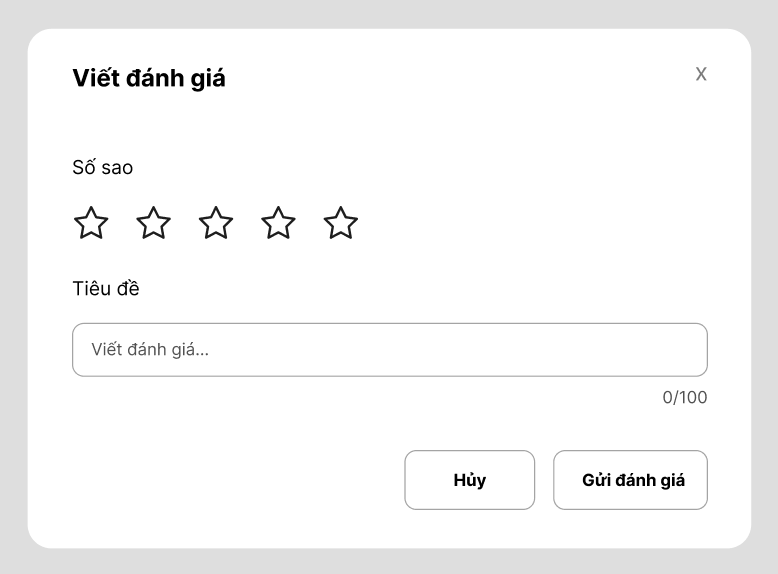
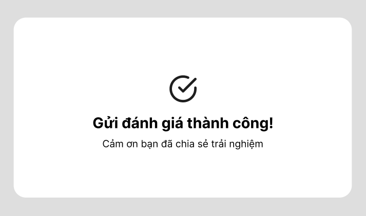

## Bước 1 — Phân tích Use Case & Xác định yếu tố UI

### Actor

**Khách hàng đã mua sản phẩm**

### Bảng ánh xạ

| Hành động nhập liệu | UI Element |
|---|---|
| Chọn số sao từ 1-5 | Star Rating |
| Nhập tiêu đề ngắn | Text Input |

---

## Bước 2 — Wireframe theo luồng

### Khung 1 — Form "Viết đánh giá"

**Yêu cầu gồm:**
- Chọn số sao 1-5
- Ô nhập tiêu đề ngắn
- Nút **Gửi đánh giá**

### Khung 2 — Sau khi nhấn "Gửi đánh giá"

**Yêu cầu:**
- Hiển thị thông báo xác nhận gửi thành công rõ ràng.

---

## Bước 3 — Tinh chỉnh theo nguyên tắc UI

Nếu chỉ đóng form mà không có thông báo gì thì đây là **Good UI nhưng Bad UX**, vì người dùng không biết đánh giá đã được gửi thành công hay chưa. Cần có thông báo xác nhận để cung cấp **Feedback** rõ ràng cho người dùng.

## Link Figma
[Rikkei Shop](https://www.figma.com/design/2qO31Oxtc613AvhUWf2tSC/Rikkei-Shop?t=DTYY2geOvhbBovPC-1)