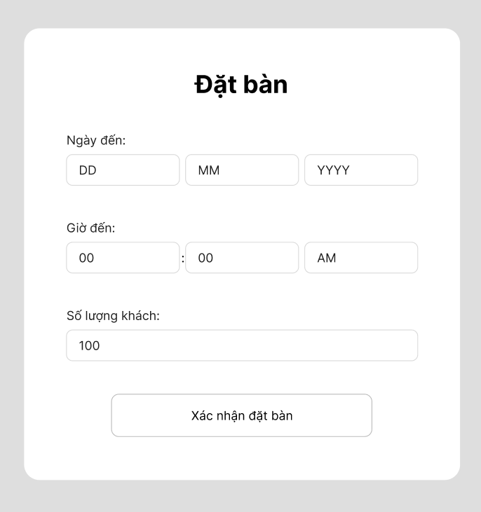
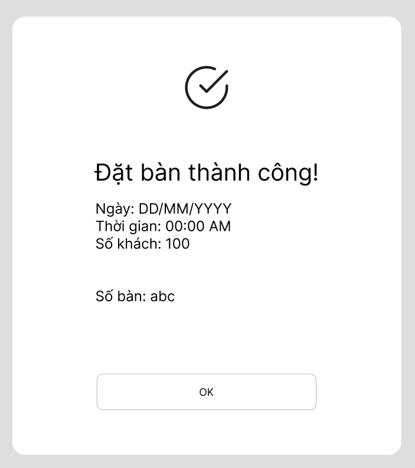

## BƯỚC 1 — PHÂN TÍCH USE CASE & XÁC ĐỊNH YẾU TỐ UI

### Actor
- Khách hàng

### UI Element

| Yêu cầu | UI Element |
|---|---|
| Chọn ngày đến | Date Picker / Bộ chọn ngày |
| Chọn giờ đến | Time Picker / Bộ chọn giờ |
| Chọn số lượng khách | Number Input / Bộ chọn số lượng |
| Xác nhận đặt bàn | Button "Xác nhận đặt bàn" |

### Thứ tự ưu tiên
1. Thông tin ngày và giờ
2. Số lượng khách
3. Nút "Xác nhận đặt bàn"

Nút "Xác nhận đặt bàn" cần có kích thước lớn, vị trí dễ nhìn và nổi bật hơn các thành phần khác để tạo Hierarchy rõ ràng.

---

## BƯỚC 2 — VẼ WIREFRAME

### Khung 1 — Khối xác nhận đặt bàn

Khối xác nhận gồm:
- Ngày đến
- Giờ đến
- Số lượng khách
- Nút "Xác nhận đặt bàn"

Nút xác nhận được đặt ở vị trí dễ nhìn và có kích thước nổi bật nhất.

### Khung 2 — Đặt bàn thành công

Khung thành công gồm:
- Thông báo "Đặt bàn thành công"
- Thông tin ngày và giờ
- Số lượng khách
- Mã đặt chỗ
- Nút "OK"

---

## BƯỚC 3 — TINH CHỈNH THEO NGUYÊN TẮC UI

Nếu màn hình chỉ hiển thị "OK" mà không có mã đặt chỗ, khách hàng sẽ khó chắc chắn rằng việc đặt bàn đã được hệ thống ghi nhận. Việc hiển thị mã đặt chỗ giúp khách hàng có thông tin cụ thể để xác nhận và tạo cảm giác an tâm hơn.