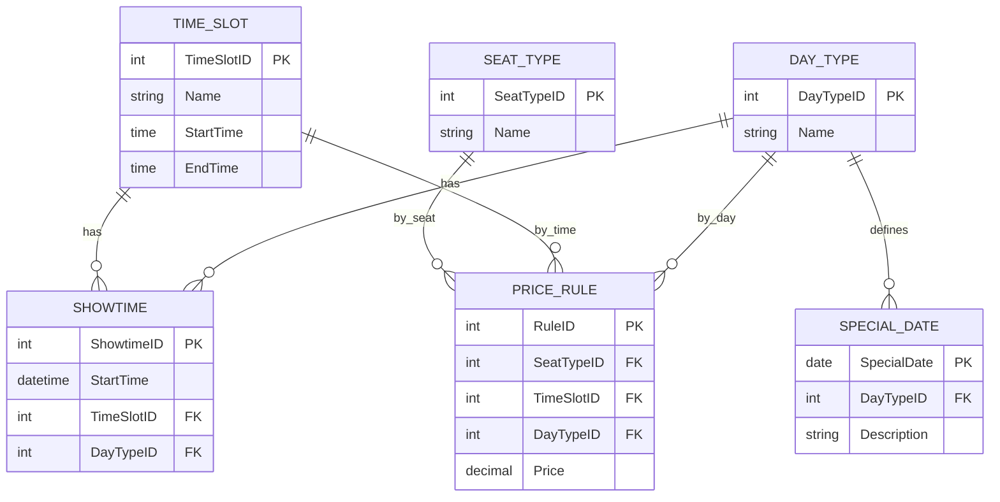

## 1. Phần 1 - Đề xuất 2 giải pháp

### Giải pháp 1: Bảng giá phẳng (Flat Price Table)

Lưu trực tiếp giá theo tổ hợp **SeatType + TimeSlot + DayType** trong một bảng.

**Mô hình dữ liệu**

| Entity | Attribute |
|---|---|
| `TICKET_PRICE` | `PriceID` (PK), `SeatType` (Standard/VIP/Sweetbox), `TimeSlot` (Before17/After17), `DayType` (Weekday/Weekend/Holiday), `Price` |

**Cách tính giá**
1. Lấy `StartTime` của `SHOWTIME`, tách ra ngày và giờ.
2. `DayType`: code tự suy từ thứ trong tuần (T2-T6 = Weekday, T7-CN = Weekend). Ngày lễ phải hard-code trong ứng dụng.
3. `TimeSlot`: code tự suy từ giờ chiếu (trước/sau 17h).
4. Tra `TICKET_PRICE` theo (SeatType, TimeSlot, DayType) → giá vé.

### Giải pháp 2: Chuẩn hóa + bảng ngày đặc biệt (Rule-based)

Tách từng yếu tố thành bảng danh mục riêng, gắn `TimeSlotID` và `DayTypeID` vào `SHOWTIME`, giá nằm ở `PRICE_RULE` liên kết bằng khóa ngoại. Ngày lễ khai báo trong `SPECIAL_DATE`.

**Mô hình dữ liệu**

| Entity | Attribute |
|---|---|
| `SHOWTIME` (bổ sung) | `ShowtimeID` (PK), `StartTime`, `TimeSlotID` (FK), `DayTypeID` (FK), *(các cột Bài 3 giữ nguyên)* |
| `TIME_SLOT` | `TimeSlotID` (PK), `Name`, `StartTime`, `EndTime` |
| `DAY_TYPE` | `DayTypeID` (PK), `Name` (Weekday/Weekend/Holiday) |
| `SPECIAL_DATE` | `SpecialDate` (PK), `DayTypeID` (FK), `Description` |
| `SEAT_TYPE` | `SeatTypeID` (PK), `Name` (Standard/VIP/Sweetbox) |
| `PRICE_RULE` | `RuleID` (PK), `SeatTypeID` (FK), `TimeSlotID` (FK), `DayTypeID` (FK), `Price` |

Ràng buộc: `UNIQUE(SeatTypeID, TimeSlotID, DayTypeID)` để mỗi tổ hợp chỉ có một giá.

**Cách tính giá**
1. Khi tạo suất chiếu, lấy `StartTime` tách ra ngày và giờ.
2. Tra `SPECIAL_DATE` theo ngày: có thì gán `SHOWTIME.DayTypeID` theo đó, không có mới suy từ thứ trong tuần.
3. Tìm `TIME_SLOT` chứa giờ chiếu và gán `SHOWTIME.TimeSlotID`.
4. Khi bán vé, lấy `SeatTypeID` của loại ghế được chọn.
5. Tra `PRICE_RULE` khớp (`SeatTypeID`, `TimeSlotID`, `DayTypeID` của suất chiếu) → giá vé.

---

## 2. Phần 2 - So sánh Trade-off

| Tiêu chí | GP1: Bảng phẳng | GP2: Chuẩn hóa + SPECIAL_DATE |
|---|---|---|
| **Linh hoạt khi Marketing đổi giá** | *Ưu:* sửa giá trực tiếp, dễ hiểu. *Nhược:* thêm loại ghế/khung giờ mới phải sửa chuỗi trùng lặp và sửa code suy ra `TimeSlot`. | *Ưu:* chỉ thêm/sửa dòng dữ liệu ở `PRICE_RULE`, `TIME_SLOT`, `SEAT_TYPE`, không đổi code. *Nhược:* nhiều bảng cần quản lý hơn. |
| **Tốc độ query** | *Ưu:* nhanh nhất, 1 bảng, không JOIN. | *Ưu:* `SHOWTIME` đã có sẵn `TimeSlotID`, `DayTypeID` nên khi bán vé chỉ tra 1 lần `PRICE_RULE` (index trên 3 cột FK). *Nhược:* cần JOIN thêm bảng danh mục khi hiển thị tên. |
| **Xử lý bẫy ngày Lễ (25/12 rơi vào Thứ Ba)** | *Nhược:* `DayType` suy từ thứ nên ra Weekday sai; phải hard-code ngày lễ, mỗi năm sửa code. | *Ưu:* `SPECIAL_DATE` khai báo 25/12 = Holiday nên `DayTypeID` của suất chiếu là Holiday, độc lập với thứ trong tuần; marketing tự thêm ngày lễ không sửa code. *Nhược:* phải nhập danh sách ngày lễ hằng năm; nếu đổi `SPECIAL_DATE` sau khi đã tạo suất chiếu thì phải cập nhật lại `DayTypeID`. |
| **Toàn vẹn dữ liệu** | *Nhược:* lưu chuỗi, không có FK, dễ sai chính tả. | *Ưu:* có FK và UNIQUE, dữ liệu nhất quán. |

**Kết luận:** Chọn **Giải pháp 2** vì đổi giá không cần sửa code, xử lý đúng bẫy ngày Lễ và đảm bảo toàn vẹn dữ liệu.

---

## 3. Phần 3 - Triển khai (ERD)

> Dán mã Mermaid vào draw.io: *Arrange → Insert → Advanced → Mermaid*.

**Luồng tính giá trên ERD:**
`SHOWTIME` (cho `TimeSlotID`, `DayTypeID`) + `SEAT_TYPE` (loại ghế được chọn) → `PRICE_RULE` → giá vé.

**Bẫy 25/12 (Thứ Ba):** `SPECIAL_DATE` có dòng 25/12 → Holiday, nên `SHOWTIME.DayTypeID` = Holiday dù là ngày thường.